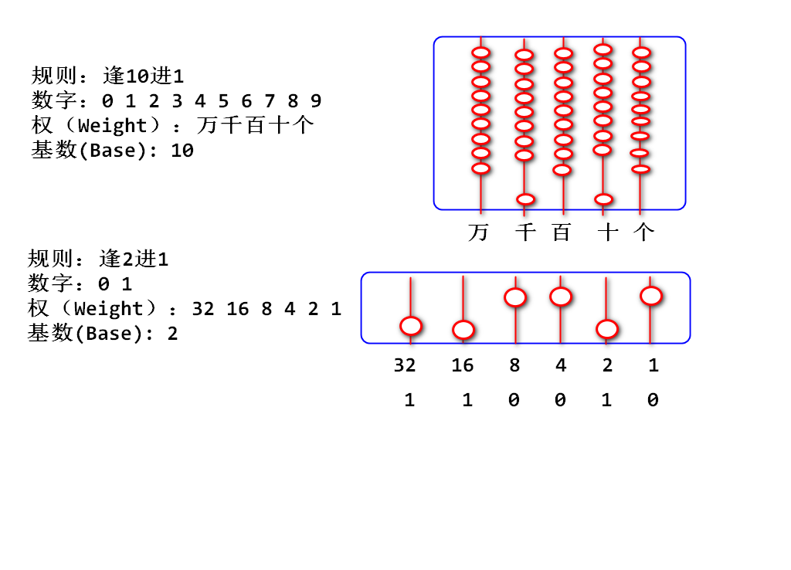
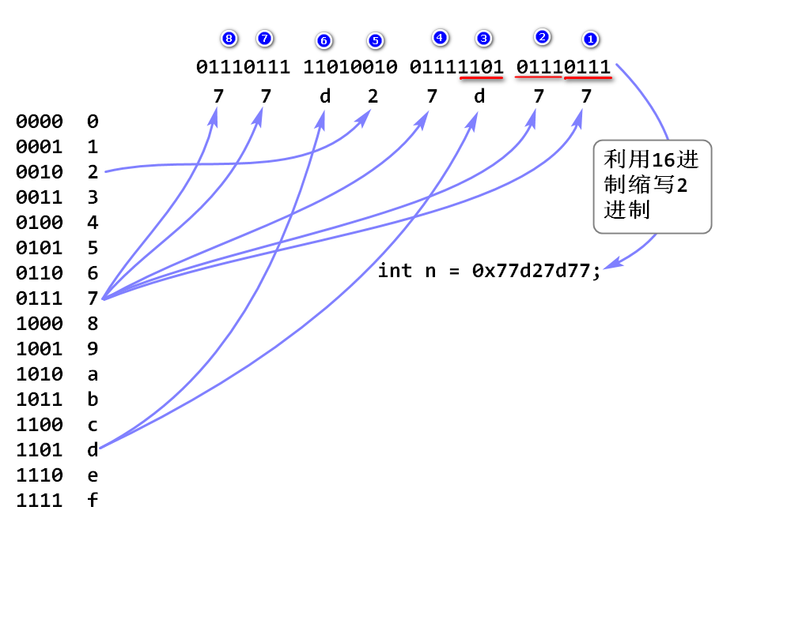
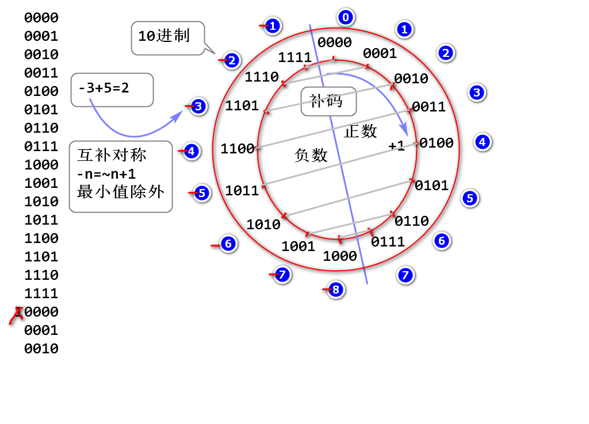

# 二进制

## 什么是2进制

2进制：逢2进1的计数规则。

int类型 0~10：

	00000000 00000000 00000000 00000000
	00000000 00000000 00000000 00000001
	00000000 00000000 00000000 00000010
	00000000 00000000 00000000 00000011
	00000000 00000000 00000000 00000100
	00000000 00000000 00000000 00000101
	00000000 00000000 00000000 00000110
	00000000 00000000 00000000 00000111
	00000000 00000000 00000000 00001000
	00000000 00000000 00000000 00001001
	00000000 00000000 00000000 00001010

案例：

	public static void main(String[] args) {
		/**
		 * 2进制演示
		 */
		int n = 50; //110010
		//110010 Integer.toString() "50"
		System.out.println(n); //"50"
		//Integer.toBinaryString 将整数在内存中的2
		// 进制存储情况转换为字符串，用于显示
		System.out.println(Integer.toBinaryString(n));
		for(int i=0; i<=100; i++) {
			System.out.println(
					Integer.toBinaryString(i));
		}
	}

## 16进制

直接书写2进制，繁琐、冗长、易错

利用16进制缩写2进制，可以达到简化书写的目的. 

缩写规则: 从2进制最低位开始，每4位2进制数缩写为1位16进制数。 

案例：

	public static void main(String[] args) {
		/*
		 * Java 7 开始支持0b开头的2进制直接量
		 * 
		 */
		int n = 0b1110110100111110100111111;
		
		/*
		 * 可以利用16进制作为2进制的简写形式 
		 */
		n = 0x77d27d77;
		System.out.println(
				Integer.toBinaryString(n));
		n = 0423;
		
		long l = 0x67abdf122122L;
	}

## 补码(一种处理负数的编码)

什么是补码： 将固定位数2进制数字， 分一半作为负数使用的编码规则。

以4位2进制数为例讲解补码编码规则

1. 计算时候保持4位不变，如果超过4位自动溢出。
2. 将最高位为0的作为正数，最高为1的作为负数，最高位称为符号位。
3. 由正数倒推设计负数的编码。
4. 补码是计算底层编码，编程语言将补码转换为10进制与人类沟通。
5. 补码是环形编码，最大值和最小值相邻。
6. 由于此编码互补对称（-n = ~n+1），顾称为补码。

案例：补码的最大值和最小值

	public static void main(String[] args) {
		/**
		 * 认识补码
		 */
		int max = Integer.MAX_VALUE;
		int min = Integer.MIN_VALUE;
		System.out.println(Integer.toBinaryString(max));
		System.out.println(Integer.toBinaryString(min));
		
		long lmax=Long.MAX_VALUE;
		long lmin=Long.MIN_VALUE;
		System.out.println(Long.toBinaryString(lmax));
		System.out.println(Long.toBinaryString(lmin));
		
		int n = -1;
		long k = -1L;
		System.out.println(Integer.toBinaryString(n));
		System.out.println(Long.toBinaryString(k));
	}

负数的补码：

	public static void main(String[] args) {
		/**
		 * 认识负数的补码
		 */
		int n = -1;
		System.out.println(Integer.toBinaryString(n));
		n = -3;
		System.out.println(Integer.toBinaryString(n));
		n = -7;
		System.out.println(Integer.toBinaryString(n));
		
		for(int i=-100; i<=0; i++) {
			System.out.println(Integer.toBinaryString(i));
		}
		
	}

> 先记住-1的补码，然后通过计算一个负数编码比-1少多少个1来得到其10进制值

补码的互补对称

	00000000 00000000 00000000 01010000     80   原码
	11111111 11111111 11111111 10101111    -81   反码    
	11111111 11111111 11111111 10110000    -80   补码

案例：

	public static void main(String[] args) {
		/**
		 * 补码的互补对称验证
		 */
		int n = 80;
		int m = ~n+1;
		System.out.println(m); 
		System.out.println(Integer.toBinaryString(n));
		System.out.println(Integer.toBinaryString(~n));
		System.out.println(Integer.toBinaryString(~n+1));
		
		n = 0x80000000;
		m = ~n+1;
		System.out.println(m);
		
	}

经典面试题目：

	System.out.println(~70);
	如上代码输出结果：（ D ） A.-68 B.-69 C.-70 D.-71

	System.out.println(~-70);
	如上代码输出结果：（ B ） A.68 B.69 C.70 D.71

## 二进制计算

运算符：

	~ 取反
	& 与计算机
	| 或
	>>> 右移位
	>> 数学右移位
	<< 左移位

### 与计算 & 

基本规则：(逻辑乘法, 有0则0)

	0 & 0 = 0
	0 & 1 = 0
	1 & 0 = 0
	1 & 1 = 1

> 计算时候需要将两个2进制数字对齐位数，对应位置计算与

栗子：

	n=       01110100 11111101 01001011 10101111
	m=       00000000 00000000 00000000 11111111  8位掩码=Mask
	k=n&m    00000000 00000000 00000000 10101111

> 如上计算结果k中存储的是数字n的最后8位数。 称为掩码计算。 其最终的结果是将 整数n的最后一个字节拆分出来。 

案例：

	int n = 0x74fd4baf;
	int m = 0xff;
	int k = n&m;

### >>> 右移位计算

规则： 将2进制数整体向右移动，低位自动溢出舍弃，高位补0

栗子：

	n =       01110100 11111101 01001011 10101111 
	m=n>>>1   001110100 11111101 01001011 1010111  
	k=n>>>2   0001110100 11111101 01001011 101011
	g=n>>>8   00000000 01110100 11111101 01001011 

代码：

	int n = 0x74fd4baf;
	int m = n>>>1;
	int k = n>>>2;
	int g = n>>>8;
	
### 将一个int拆分为4个byte

栗子：

	                    b1       b2       b3       b4
	n =              01110100 11111101 01001011 10101111
	
	b1=(n>>>24)&0xff 00000000 00000000 00000000 01110100 	

	n>>>16           00000000 00000000 01110100 11111101  
	b2=(n>>>16)&0xff 00000000 00000000 00000000 11111101

	n>>>8            00000000 01110100 11111101 01001011
	b3=(n>>>8)&0xff  00000000 00000000 00000000 01001011 
	
	b4=n&0xff        00000000 00000000 00000000 10101111

代码：

	int n = 0x74fd4baf;
	int b1 = (n>>>24) & 0xff;
	int b2 = (n>>>16) & 0xff;
	int b3 = (n>>>8) & 0xff;
	int b4 = n & 0xff;
	//验证

### | 或计算
	
基本规则：（逻辑加法 有1则1）

	0 | 0 = 0
	0 | 1 = 1
	1 | 0 = 1
	1 | 1 = 1

> 计算时候需要将两个2进制数对齐位置，对应位置进行或计算

栗子：

	n =        00000000 00000000 00000000 10111010
	m =        00000000 00000000 10111101 00000000
	k=n|m      00000000 00000000 10111101 10111010

> 如上案例的意义：数字n和m拼接在一起

代码：

	int n = 0xba;
	int m = 0xbd00;
	int k = n|m;
	//按照2进制输出

### << 左移位

将2进制数字整体向左移动，高位自动溢出，低位补0

栗子：

	n=         01110111 10101011 10100100 00011111 
	m=n<<1     1110111 10101011 10100100 000111110
	k=n<<2     110111 10101011 10100100 0001111100
	g=n<<8     10101011 10100100 00011111 00000000  

用途：将4个byte拼接为int

	b1 =          00000000 00000000 00000000 10110101
	b2 =          00000000 00000000 00000000 01101111
	b3 =          00000000 00000000 00000000 11101101
	b4 =          00000000 00000000 00000000 10111011
	
	b1<<24        10110101 00000000 00000000 00000000
	b2<<16        00000000 01101111 00000000 00000000
	b3<<8         00000000 00000000 11101101 00000000
	b4            00000000 00000000 00000000 10111011
	n             10110101 01101111 11101101 10111011
	n=(b1<<24)|(b2<<16)|(b3<<8)|b4;	

代码：将4个byte合并为一个int
	
	int b1 = 0xb5;
	int b2 = 0x6f;
	int b3 = 0xed;
	int b4 = 0xbb;
	int n = (b1<<24) | (b2<<16) | (b3<<8) | b4;
	//检查。。。

## 移位计算的数学意义

10移动小数点计算：

	十进制数            191321.    
	向右移动小数点     1913210.    扩大10倍
	向右移动小数点    19132100.    扩大100倍
	如果看作小数点不动, 数字向左移动

2进制移位计算，向左移动一次扩大2倍

	n =     00000000 00000000 00000000 00110010    50
	m=n<<1  0000000 00000000 00000000 001100100   100
	k=n<<2  000000 00000000 00000000 0011001000   200 
	... 
	a=n>>1  000000000 00000000 00000000 0011001    25
	b=n>>2  0000000000 00000000 00000000 001100    12  除以2小方向取整数

案例：

	int n = 50;
	int m = n<<1; //100
	int k = n<<2; //200
	int a = n>>1; //25
	int b = n>>2; //12

## `>>>` 与 `>>`的区别

`>>>` 逻辑右移位，2进制数字整体向右移动，低位溢出，高位补0
`>>`  数学右移位，2进制数字整体向右移动，低位溢出，负数补1，正数补0，运算结果相当数学除法，除以2向小方向取整数。

栗子：

	n =      11111111 11111111 11111111 11001110    -50
	m =n>>1  111111111 11111111 11111111 1100111    -25
	s =n>>2  1111111111 11111111 11111111 110011    -13
	k =n>>>1 011111111 11111111 11111111 1100111  比最大值少24

代码： 略

`>>>` 与 `>>`的区别： `>>>`就是将数字整体向右移动，不考虑数学结果，适用于单纯数据移位拆分等计算。 `>>`用于替代数学计算，达到提高运算性能的目的。

如：

	if(index > size/2){
		//...
	}
	
	替换为：
	
	if(index > size>>1){
		//...
	}

经典面试题目：

	n * 32 可以替换为（  ？   ） 答案： n<<5

