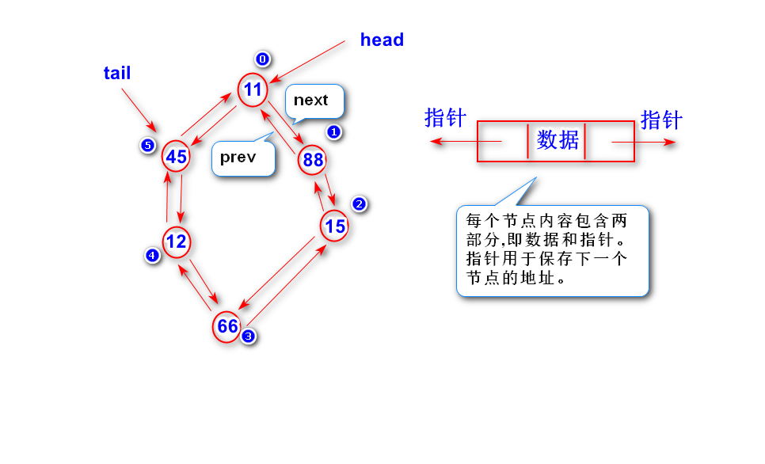

# 1.什么是链表?

	链表由一系列节点构成，其中，每个节点
	包含两部分内容(一部分是数据，另外一部分是
	指针）。
	注:
		指针指向了下一个节点(也就是说通过该指针
	可以找到下一个节点)。
		如果只有一个指向下一个节点的指针，称之为
	单向链表。
		如果有两个指针(一个指向上一个节点，一个指)
	向下一个节点)，称之为两向链表。
		如果最后一个节点与第一个节点也通过指针
	连接起来，称之为双向循环链表。

# 2.链表跟数组相比，优缺点是什么?
	
	数组的优点:
		依据下标可以非常快速的找到某个元素。
	数组的缺点:
		删除和插入操作比较耗费时间，需要重新
	移动大量元素(包括扩容)。
		数组需要有连续的地址空间。
	
	链表的优点:
		删除和插入操作速度非常快。
		链表不需要连续的地址空间。
	链表的缺点:
		依据下标查找某个元素比较慢。			
		链表节点需要保存节点的地址，同数组相比，
		需要占用更多的内存。

		

