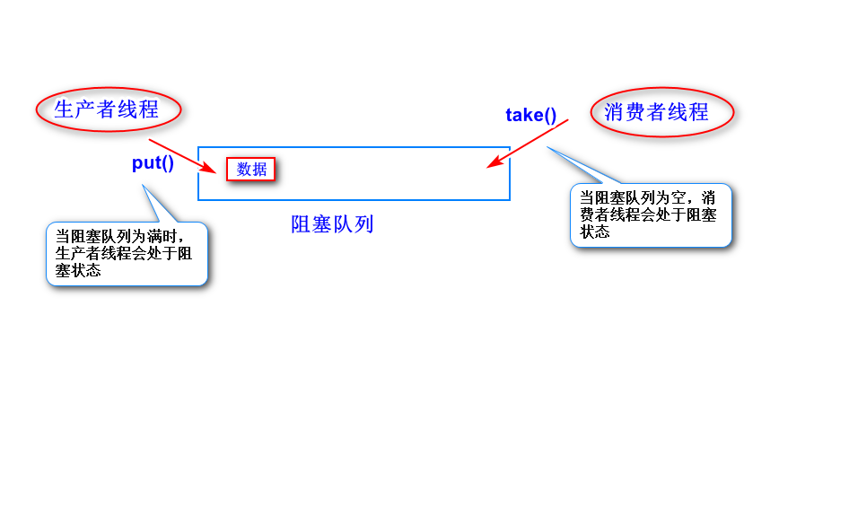
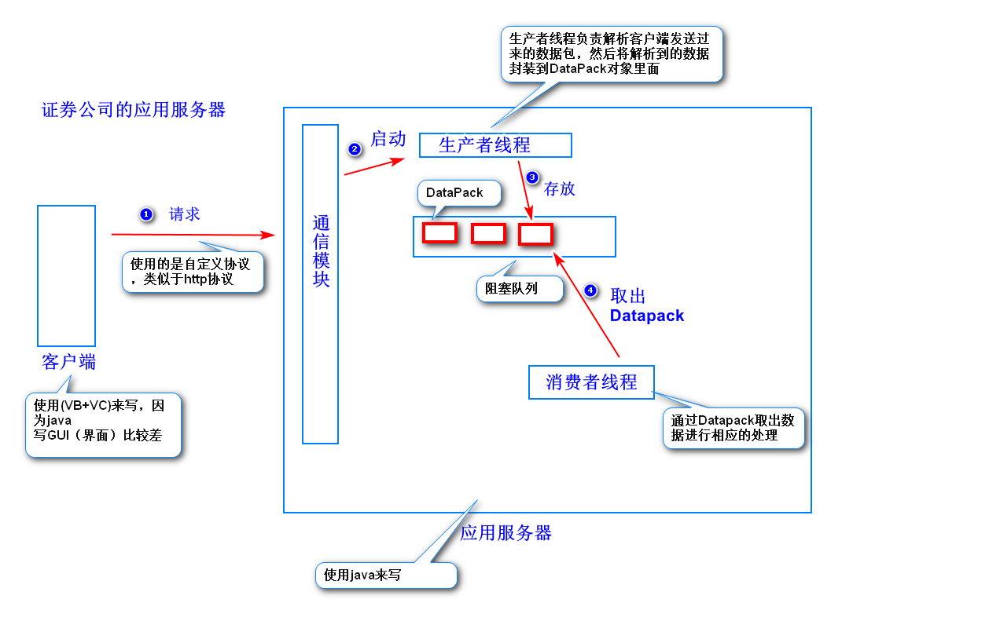
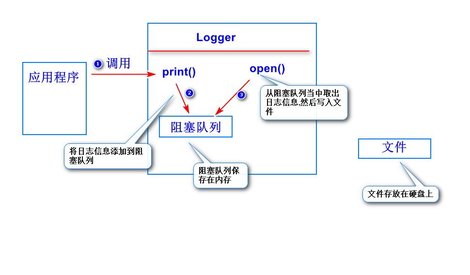
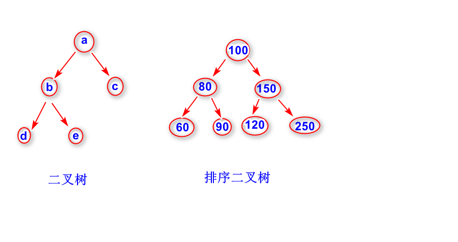

# 1.生产者、消息者模型与阻塞队列
## (1)什么是生产者?
	
	生产者负责产生数据。

## (2)什么是消费者?

	消费者负责消费数据。

## (3)生产者、消费者模型用来解决什么问题?

	用来解决生产者生产数据与消费者消费数据
	不同步的问题。
	生产者产生数据之后，将这些数据存放到阻塞
	队列里面，消息者从阻塞队列当中取出数据。

## (4)什么是阻塞队列?

	阻塞队列可以在多线程环境下使用，当阻塞队列满时，
	生产者线程会阻塞（即暂时挂起)。当阻塞队列为空时，
	消费者线程会阻塞。
	阻塞队列一般都解决了线程安全问题。

## (5)生产者、消费者模型的经典使用场合

    a.订单处理
		订单信息先写入到阻塞队列，然后消息者
		线程从阻塞队列中取出数据，写到数据库。
	b.应用服务器设计(用于任务的分派)

	c.日志
		可以让生产者线程将日志信息先写入阻塞
		队列，然后让消息者线程从阻塞队列当中取
		出日志信息，然后写入数据库。　

## (6)经典案例(日志处理)

	

## (7)相关的接口与类
	BlockingQueue接口
		注：该接口继承Queue接口。
	LinkedBlockingQueue类
		注：底层实现是一个链表，每添加一个消息(数据),
		就需要创建一个新的结点，如果并发量很大，
		可能会影响系统GC。
		除此之外，LinkedBlockQueue的put方法和
		take方法用的是不同的锁，并发性能比较好。
	ArrayBlockingQueue类
		注：底层实现是一个数组。
		ArrayBlockingQueue的take方法和put方法
		用的是同一个锁，并发性能差一些。

# 练习
	Producer线程每隔5秒向阻塞队列当中添加一个
	随机数。Consumer线程每隔2秒从阻塞队列当中
	取出随机数然后输出。
	Producer类(Producer线程类)
	Consumer类(Consumer线程类)
	Test类(启动Producer线程和Consumer线程)

# 2.二叉树
## (1)什么是二叉树?
	任意一个节点，最多只有两棵子树的树结构。
	注：
		这两棵子树一般称之为左子树和右子树。
## (2)排序二叉树(搜索二叉树)
	任意一个节点，其左子树上的节点值比该节点的
	值小，其右子树上的节点值比该节点的值要大。
	左右子树也是一个排序二叉树。
	注：
		排序二叉树不允许出现重复元素。

		

